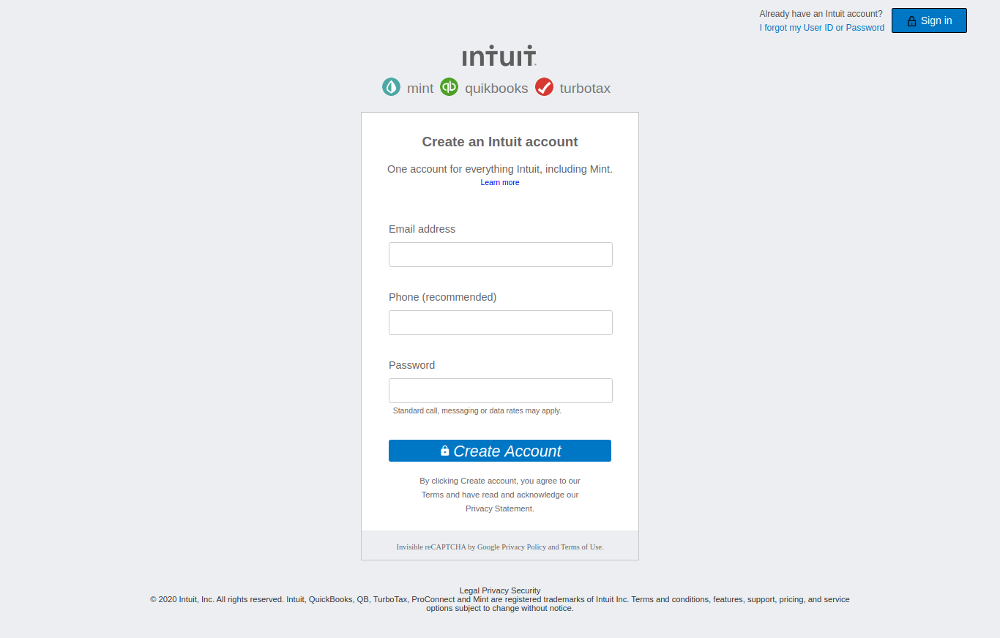

# Displaying and Inputting Data: mint clone web page
This project is a replica of the mint.com sign up page.

The goal here is to focus on making a simple and clean design based on mint.com sign up page.
That means three things – adding navigation bar, adding an input form and adding a footer.

# Built With
* HTML
* CSS
* fonts.googleapis.com
* w3.css

# Live Demo
**[Live Demo](https://raw.githack.com/rindrajosia/mint-clone/feature-one/index.html)**

# Getting Started
To use it locally, you need to :
1. Fork the repository to your GitHub account.
2. Choose a local folder for the cloned files.
3. Clone the repository to your local machine.
4. Double click on 'index.html'.

# Authors

**Gabrie Lhilarion**

* Github: **[@gabrie-lhilarion](https://github.com/gabrie-lhilarion)**
* Twitter: **[@gabrielDeman](https://www.twitter.com/gabrielDeman)**
* Linkedin: **[linkedin](https://www.linkedin.com/in/gabrielhilarion/)**

**Rindra Josia**

* Github: **[@rindrajosia](https://github.com/rindrajosia)**
* Twitter: **[@rindrajosia](https://twitter.com/josia_rindra)**
* Linkedin: **[linkedin](https://www.linkedin.com/in/rindra-josia-99b2111a2/)**

#  Contributing

Contributions, issues and feature requests are welcome!
Feel free to check the **[issues](https://github.com/gabrie-lhilarion/youtube-homepage/issues)** page.

#  Show your support

  Give ⭐️ if you like this project!

# Acknowledgments

* mint.com
* Microverse
* Contributors
